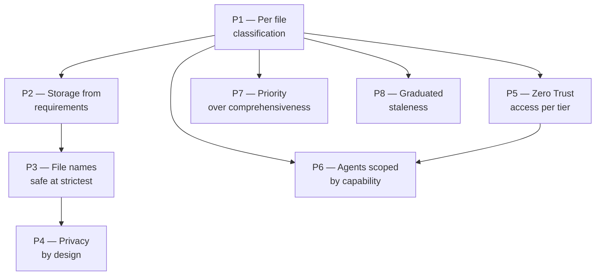

(chap-principles)=
# 01 — Principles

EKA is grounded in eight principles. They are stated abstractly so
they survive technology changes; specific implementations
(repositories, hooks, agent runtimes) are defended in later chapters.

(sec-access-levels)=
## Access levels — quick orientation

Several principles below refer to **access tiers**. The full
treatment is in [primer 3 — tier architecture](#chap-tier-architecture);
the one-line orientation:

| Tier | Short name | Audience | Storage |
|------|-----------|----------|---------|
| **L0** | Public | Anyone on the internet | Public repository |
| **L1** | Internal | All authenticated employees | Internal repository (auth-gated) |
| **L2** | Confidential | Named team with documented need-to-know | Private repository |
| **L3** | Restricted | Specific individuals (per-file ACL) | Object store (e.g., Google Drive) |
| **L4** | Live secrets | Production systems only — **never in docs** | Out of EKA scope |

A document's tier is **derived** from its classification, not declared
independently. The next chapter ([classification model](#chap-classification-model))
makes "classification" precise. For now: assume "higher tier = stricter
access."

---

## P1 — Classify per file using a recognized standard

**Statement.** Every document declares its sensitivity using a
standardized triple: Confidentiality × Integrity × Availability, each
rated LOW / MODERATE / HIGH. The folder containing the document gives a
default; individual files can override **downward only** (toward less
sensitive) with a documented reason. Access tier is derived from this
triple, not declared separately.

**Why this matters.** Multiple regulators speak the same vocabulary
(NIST, ISO, EU). Classifying once in that vocabulary means evidence
flows to every framework without translation. Folder-default + file-
override gives flexibility without losing the safe baseline. Override-
down only prevents drift in the leak-prone direction.

:::{note} Standards reference
The triple comes from [FIPS 199](https://csrc.nist.gov/pubs/fips/199/final).
The vocabulary appears in
[NIST SP 800-53](https://csrc.nist.gov/pubs/sp/800/53/r5/upd1/final),
[ISO/IEC 27001:2022](https://www.iso.org/standard/82875.html),
[FedRAMP](https://www.fedramp.gov/), and EU regulations.
:::

**Empirical test.** Pick 10 random files; verify their declared
classification matches the folder's domain default (or has an
explicit override reason). Mismatches indicate classification drift.

**Implementation hint (full detail in spec):** YAML frontmatter under
the `options.eka.*` namespace, validated by a pre-commit hook against
a JSON Schema.

---

## P2 — Storage choice follows access requirements

**Statement.** Different access requirements need different storage
primitives. A repo's access control is per-repo. An object store's
access control is per-file. Pick the primitive that matches the
control granularity you need. A pre-commit hook prevents content
from exceeding the storage's declared maximum tier.

**Why this matters.** Forcing per-file access into a repo via branch
protection, CODEOWNERS reviewer-required rules, or sub-modules
creates brittle and easily-circumvented controls. Use the right tool
for the job.

**Empirical test.** Attempt to commit a document classified higher
than the repo's declared maximum. The commit must be rejected with a
clear error message naming which limit was exceeded.

**Implementation hint:** repo-level `CLASSIFICATION.yml` declares
`max_tier`. Pre-commit hook reads it and refuses tier mismatches.

---

## P3 — File names follow the strictest place they appear

**Statement.** File names and directory paths show up in many more
places than file bodies: file trees, commit logs, CI output, URLs,
pull-request titles, audit-log entries. They leak by default.
Therefore: file names must be safe at the most-public location they
could appear, regardless of where the content currently lives. At
confidential tiers, external entity names get replaced by stable
codes drawn from a single mapping file.

**Why this matters.** Body-text leakage requires the reader to have
content access; file-name leakage just requires visibility of the
tree. A repo whose file tree reads `customer/rfps/c001-2026-q3.md`
tells an outsider very little; the same tree reading
`customer/rfps/{real-customer-name}-2026-q3.md` tells a competitor a
great deal.

**Empirical test.** Search for every real entity name in the file
paths of confidential-tier repositories. Any match is a finding. A
clean search is the bar.

**Implementation hint:** stable numeric codes (e.g., `C001`) for paths;
a small `CODENAMES.yml` (itself classified at the same tier as the
codes it protects) maps codes to real entities.

---

## P4 — Privacy-preserving content from the first commit

**Statement.** Documents at confidential tiers use the codename
convention in body text (first mention pairs codename and real name
where permitted; later mentions may use either form). Any document
that names identifiable individuals declares them in metadata so
right-to-erasure requests become a query, not a grep across all
content.

**Why this matters.** EU and US privacy regulations require both
pseudonymization (less identifying than full names) and the ability to
delete an individual's data on request. Declaring data subjects in
metadata lets an agent or operator answer "where is subject X
referenced?" in seconds; without it, the answer takes hours of
full-text search and is never reliable.

:::{note} Standards reference
[GDPR Article 25](https://gdpr.eu/article-25-data-protection-by-design/)
mandates data protection by design and by default.
[GDPR Article 17](https://gdpr.eu/article-17-right-to-be-forgotten/)
is the right to erasure.
[CCPA / CPRA](https://oag.ca.gov/privacy/ccpa) gives California
residents analogous rights.
:::

**Empirical test.** Given a data-subject identifier, an agent
produces a list of every document referencing that subject in under
one minute. A full-text grep produces the same list. The two agree.

**Implementation hint:** frontmatter `data_subjects: [...]` is the
authoritative index; body-text uses the codename convention.

---

## P5 — Access architecture follows Zero Trust per tier

**Statement.** Each access tier adds an authentication / authorization
requirement on top of the previous one. Every access — read and
write — is auditable. Audit retention is at least 12 months
(longer for more sensitive tiers).

**Why this matters.** Standard access architectures for cloud-era
systems map directly to documentation. Re-using the same patterns
means the same access decisions an organization makes for its
applications work for its documents — no special second framework.

:::{note} Standards reference
[NIST SP 800-207](https://csrc.nist.gov/pubs/sp/800/207/final) is
the canonical specification of Zero Trust Architecture.
:::

**Empirical test.** Pick a random higher-tier file. Attempt to read
it from an account that lacks the necessary group membership. Read
must be denied. The denial must appear in the audit log within 5
minutes.

**Implementation hint:** SSO for L1; SSO + RBAC for L2; SSO + RBAC +
MFA + per-file ACL for L3.

---

## P6 — Agents are scoped by capability, not by instruction

**Statement.** Each access tier has its own agent runtime with
authentication realm and tool scope locked to that tier. An L1 agent
cannot read L2 content even when instructed to. The boundary is
enforced by the *absence of the capability*, not by an instruction
the agent might fail to follow.

**Why this matters.** LLM-based agents are not reliable
instruction-followers for "do not read X." Removing the capability is
reliable. The pattern parallels how production systems achieve
isolation: same code, same person, different network segment, different
IAM role.

**Empirical test.** Each agent passes a tier-isolation smoke-test
suite: positive prompts (operations within tier — should succeed) and
negative prompts (operations across tier — should refuse and log).
Pass = ready to onboard.

**Implementation hint:** per-tier agent home directory, per-tier MCP
tokens, per-tier `CLAUDE.md` (or equivalent system prompt).

---

## P7 — Prioritize practical controls over comprehensive ones

**Statement.** The operational priority list is the
[CIS Critical Security Controls](https://www.cisecurity.org/controls)
("CIS Controls"), Control 3 (Data Protection) sub-controls 3.1
through 3.7. NIST SP 800-53 is referenced for vocabulary; ISO 27002
for international portability; CIS gives the order in which to
implement.

**Why this matters.** NIST 800-53 is comprehensive but flat (no
priority). ISO 27002 is normative without sequencing. CIS gives
practitioner-grade staging: "this first, then that." For a startup,
the staging is the most valuable part.

**Empirical test.** A quarterly self-assessment against CIS Control
3.1–3.7. Each sub-control rated red / yellow / green. Target: all
green by end of the second quarter after adoption.

**Implementation hint:** treat CIS-3 as a quarterly OKR.

---

## P8 — Staleness is graduated, not auto-elevating

**Statement.** Documents declare a review cadence in metadata.
Overdue review triggers a graduated response: visual flag → archive
folder → eventual purge candidate. Classification is *not*
auto-elevated on overdue review; staleness affects visibility and
location, not access.

**Why this matters.** Auto-elevating classification on overdue review
punishes durable content and breaks agent workflows. The defensive
intent (assume stale = sensitive) creates false positives that erode
trust in the system. Graduated staleness creates pressure to review
without disruption.

**Empirical test.** Monthly report enumerates documents past their
review-due date. Zero documents past 60 days without a visible flag.
Zero documents past 120 days without archival.

**Implementation hint:** the `eka-audit-stale` skill (in the spec)
runs the graduated workflow automatically; humans review the
purge-candidate list.

---

## How the principles relate

P1 is the load-bearing principle. Everything else defends or enforces
it. P5 and P6 together provide the *safety* property (humans and
agents see only what their tier permits). P3 and P4 together provide
*privacy* (the existence of sensitive entities is not casually
disclosed). P7 and P8 keep the system running over time without
seizing up.

## What's contestable

A few principles will face pushback. Listed honestly so reviewers can
challenge.

- **P1's per-file granularity** is a soft constraint. Some
  organizations prefer strict per-file declaration with no folder
  inheritance, on the grounds that inheritance lets authors avoid
  thinking about classification. EKA's position: humans will avoid
  thinking either way; defaulting to the safe baseline reduces the
  "forgot to classify" failure mode.
- **P3's codename mandate** adds friction. The alternative is "trust
  repo-level ACLs and let file names be descriptive." EKA's position:
  the friction is one lookup table; the value is no file-tree leak on
  accidental visibility flip.
- **P8's no-auto-elevate** stance is the most contested. Defensive
  security culture argues the other way. EKA's position: the false
  positive rate makes auto-elevate operationally untenable; the archive
  folder + visible flag provides similar accountability.

The [classification model](#chap-classification-model) operationalizes
P1 and P2 in concrete detail.
