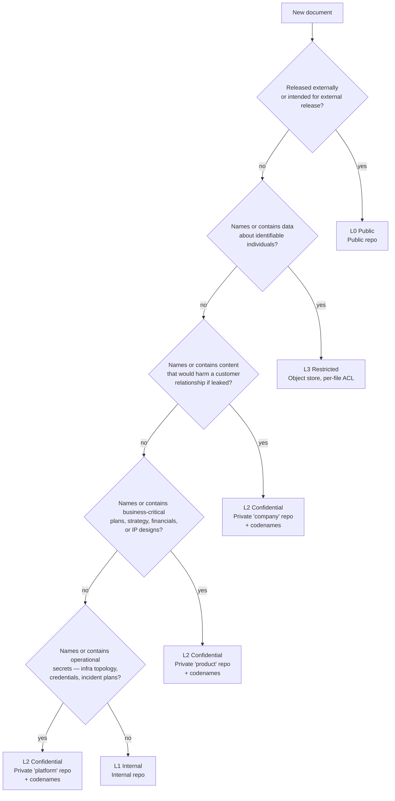

(chap-classification-model)=
# 02 — Classification Model

This chapter operationalizes [P1](#chap-principles): how to classify a
new document, and what the classification means.

Contents:

- [The FIPS 199 vocabulary](#sec-fips-199)
- [The six data domains](#sec-domains)
- [Domain baselines](#sec-domain-baselines)
- [Per-document classification](#sec-per-doc-classification)
- [The decision tree](#sec-decision-tree)
- [Worked examples](#sec-worked-examples)
- [What about edge cases?](#sec-edge-cases)

---

(sec-fips-199)=
## The FIPS 199 vocabulary

Every document declares an impact rating along three security
objectives, from the [Federal Information Processing Standard 199](https://csrc.nist.gov/pubs/fips/199/final):

| Objective | Question it answers | Levels |
|-----------|---------------------|--------|
| **Confidentiality** | What's the impact if unauthorized parties read this? | LOW / MODERATE / HIGH |
| **Integrity** | What's the impact if this content is corrupted or maliciously modified? | LOW / MODERATE / HIGH |
| **Availability** | What's the impact if this content is unavailable when needed? | LOW / MODERATE / HIGH |

The aggregate **Security Category (SC)** of a document is the tuple:

```
SC(document) = {(C, impact), (I, impact), (A, impact)}
```

Examples:

```
SC(public marketing page)     = { (C, LOW),      (I, LOW),      (A, LOW)      }
SC(internal architecture doc) = { (C, MODERATE), (I, MODERATE), (A, LOW)      }
SC(customer contract)         = { (C, HIGH),     (I, HIGH),     (A, MODERATE) }
SC(source code design)        = { (C, HIGH),     (I, HIGH),     (A, HIGH)     }
SC(employee performance doc)  = { (C, HIGH),     (I, MODERATE), (A, LOW)      }
```

### How to rate impact

Use the **worst-case-loss** test:

- **LOW** — "If this were lost or leaked, it would be embarrassing or
  mildly inconvenient. Operations continue. No regulatory exposure.
  No customer notification required."
- **MODERATE** — "Loss or leak would damage competitive position,
  damage employee trust, require a notification to a customer, or
  trigger internal investigation. Recovery takes weeks but is
  achievable."
- **HIGH** — "Loss or leak would cause material harm — customer
  contract termination, regulatory action, individual privacy harm,
  business-stopping data loss. Recovery may be incomplete."

Rate against the realistic worst-case, not the worst conceivable
case. Every document containing a customer name is not automatically
HIGH confidentiality; many such documents are routine.

(sec-domains)=
## The six data domains

Every document belongs to exactly one **data domain**. Domains
establish the default classification baseline; folder structure aligns
with domains.

| Domain | What lives here | Owner |
|--------|-----------------|-------|
| **Public** | Released externally — marketing, public documentation, OSS components, recruiting content | Marketing / DevRel |
| **Customer Data** | Customer-identifiable records, customer-supplied PII, customer-specific configurations, customer credentials | Engineering + Legal |
| **People Data** | Employee identifying information, performance, compensation, hiring scorecards, 1:1 notes | HR + Engineering managers |
| **Business Data** | Strategy, financial planning, board materials, customer commercial relationships, RFPs | CXO + Leadership |
| **Product Data** | IP — source code designs, ML models, internal product roadmaps, technical architecture | Engineering |
| **Operational Data** | Infrastructure plans, network topology, deployment runbooks, credentials inventory, incident response plans | Platform / DevOps + Security |

This is a refinement of NIST SP 800-60's information-type catalog,
collapsed into the categories that matter at startup-to-mid-enterprise
scale. Each domain maps to a different set of [compliance drivers](#chap-compliance-mapping).

### Why six, not four

Three boundaries that matter and would be lost in a smaller scheme:

- **Customer vs. Business.** Customer Data is governed by privacy law
  (GDPR / CCPA / HIPAA-adjacent). Business Data is governed by
  contract / commercial law. Different controls, different audit
  trails.
- **Product vs. Operational.** Product Data is the IP (designs, code,
  models). Operational Data is the runtime substrate (infra, secrets,
  incident response). Confusing them leaks "what we built" with "how
  we run it."
- **Public is its own domain.** Treating Public as a leaf of "Business"
  invites accidental promotion ("this was business but we decided to
  publish it"). Making Public a first-class domain forces a
  classification review at publication time.

(sec-domain-baselines)=
## Domain baselines

Each domain has a **baseline classification** that applies to every
document in that domain by default. Files can override *downward*
(e.g., declare a routine doc LOW even though the domain default is
MODERATE) with an explicit `override_reason`. Files cannot override
*upward* without moving to a tier-appropriate repo.

| Domain | Baseline SC | Default tier | Override direction |
|--------|-------------|--------------|-------------------|
| Public | {C: LOW, I: MODERATE, A: LOW} | L0 | Down only — must justify why an integrity claim is LOW |
| Customer Data | {C: HIGH, I: HIGH, A: HIGH} | L3 (object store) | Down — only for fully de-identified aggregates |
| People Data | {C: HIGH, I: MODERATE, A: MODERATE} | L3 (object store) | Down — only for fully anonymized statistics |
| Business Data | {C: HIGH, I: HIGH, A: MODERATE} | L2 (private repo) | Down for board-summary-grade content; *up* impossible (already HIGH on C and I) |
| Product Data | {C: HIGH, I: HIGH, A: HIGH} | L2 (private repo) for plans; production code in source repos | Down for publishable architecture overviews |
| Operational Data | {C: HIGH, I: HIGH, A: HIGH} | L2 (private repo) for plans; live secrets are L4 (not in docs) | Down for high-level platform docs |

:::{note} Why Customer & People Data go to L3, not L2
Per-file ACL is essential for these two: a specific customer's RFP
response should not be readable by every reader of the company-docs
repo; a specific employee's performance review should not be readable
by every reader of any company-wide repo. L3 (object store, native
per-file ACL) is the natural home. *Aggregate* customer analytics
(e.g., which customers ranked highest last quarter) can live at L2 if
the customer identifiers are codenamed.
:::

:::{tip} Six is the recommended decomposition, not the mandate
Six domains is what works at startup-to-mid-enterprise scale for most
B2B SaaS organizations. Real-world variation is expected:

- **Smaller team / two-person consultancy** — collapse Business +
  Product + Operational into one "Internal" domain. The principles
  still apply.
- **B2C company** with millions of consumer accounts — Customer Data
  defaults closer to L3 by sheer volume; you may want to split
  Customer into `customer-identity` and `customer-behavior`.
- **Regulated industry** (healthcare, finance, fed contractor) — add a
  7th domain like `compliance-controlled` for content governed by
  sector-specific regulations (HIPAA-PHI, SOX-financial, FedRAMP-CUI).
- **Multi-product company** — split Product into `product-{name}` per
  major product line if their access boundaries differ.

The framework is designed to accept **1-2 additional domains** without
strain. Beyond that, reconsider whether you're trying to model
information *types* (correct) or *workflows* (incorrect — that's what
folders within a domain are for). Each additional domain needs its own
baseline classification, control mapping, and review cadence
declared.
:::

(sec-per-doc-classification)=
## Per-document classification

Every markdown file in an EKA repo has a `classification` block in its
YAML frontmatter:

```yaml
---
title: ...
domain: business              # one of: public | customer | people | business | product | operational
classification:
  C: HIGH                     # LOW | MODERATE | HIGH
  I: HIGH
  A: MODERATE
tier: L2                      # derived; validated by pre-commit hook
override_reason: null         # required if classification differs from domain baseline
data_subjects: []             # identifiers of individuals mentioned in body (for GDPR Art. 17 erasure)
codename_refs: [C001, C002]   # codenames used in this doc (helps cross-ref to CODENAMES.yml)
owner: jdoe@example.com
last_reviewed: 2026-05-15
next_review: 2026-11-15
review_cadence: 180d
status: draft                 # draft | review | approved | superseded | archived
labels: [auth, security, customer]
related:
  - drive:1abc...             # related external doc with URI scheme
  - plane:proj-123            # related ticket
  - repo:{org}-eng-docs/proposals/foo
---
```

The classification block is what the pre-commit hook reads to validate
that:

1. The classification matches (or downgrades from) the domain
   baseline.
2. The `tier` value is consistent with the classification.
3. The repo's `CLASSIFICATION.yml` `max_tier` is not exceeded.
4. If `data_subjects` is non-empty, the tier is L2 or above.
5. `next_review = last_reviewed + review_cadence` (drift check).

[Chapter 5](#chap-metadata-and-labeling) specifies the full schema and
validation rules.

(sec-decision-tree)=
## The decision tree

When creating a new document, classify it via this decision tree:



The tree resolves in order: any "yes" answer terminates classification
at the highest-applicable tier. A document about a sensitive customer
RFP *with* references to a named employee resolves to L3 (because Q2
matches first), not L2 — even though both apply.

(sec-worked-examples)=
## Worked examples

| Document | Domain | Classification SC | Tier | Storage | Notes |
|----------|--------|--------------------|------|---------|-------|
| Open-source SDK README | Public | {L, M, L} | L0 | Public repo | Integrity MODERATE — wrong content damages reputation |
| New-hire onboarding guide | Business → published-internal | {M, M, L} | L1 | Internal repo | No customers named |
| Service architecture diagram (current) | Product → published-internal | {M, M, M} | L1 | Internal repo | Names internal services; no IP per se |
| Tech proposal: auth-stack overhaul | Product | {H, H, M} | L2 (split) | Private repo; L1 executive summary | The detailed flows describe attack surface — L2; the summary is L1 |
| Customer RFP response | Customer | {H, H, H} | L3 (with codename) | Drive folder shared with account team | File: `c001-2026-q3-security-questionnaire.md` |
| Employee Q2 performance review | People | {H, M, L} | L3 | Drive folder, lead+employee ACL | `data_subjects: [EMP-042]`; codenamed externally |
| Production incident runbook | Operational | {H, H, H} | L2 | Private platform repo | Names internal hosts; codename customer impact if discussed |
| Q3 board update | Business | {H, H, M} | L2 (with codenames) | Private company repo | `data_subjects: [BOARD-001..006]` |
| Hiring scorecard for a candidate | People | {H, H, L} | L3 | Drive, per-hire-loop folder ACL | `data_subjects: [CAND-2026-W12-001]` |
| Aggregate analytics (no customer names) | Customer → aggregated | {M, M, L} | L1 | Internal repo | Aggregation removes per-customer identifiability |

### The split-document pattern (illustrated)

A common case worth dwelling on: a technical proposal that has both a
**high-level summary** (safe for the broad eng team) and **detailed
specifics** (production internals, attack-surface, customer impact)
that should not be widely visible. EKA's recommended pattern is to
**split** the document into two halves at two tiers, cross-linked:

- **L1 executive summary** lives in the internal proposals folder.
  Covers: goals, non-goals, high-level approach, rollout plan, test
  scenarios. Suitable for the whole engineering team.
- **L2 detailed companion** lives in the private company-docs repo
  under `product/designs/{proposal-slug}/`. Covers: detailed flows,
  threat model, customer-specific risk analysis, named platform
  internals. Restricted to leadership team.

Both pieces have their own frontmatter; each cross-references the
other via the `related:` field with the EKA URI scheme:

```yaml
# In the L1 summary frontmatter
related:
  - repo:{org}-company-docs/product/designs/{slug}/

# In the L2 companion frontmatter
related:
  - repo:{org}-eng-docs/proposals/{slug}/
```

This pattern repeats for any document that has both a high-level half
and a detail half — proposals, incident postmortems with customer
impact, strategic plans with confidential customer-specific sections.

(sec-edge-cases)=
## What about edge cases?

### A document spans multiple domains

A spec for a customer-facing product feature is both Customer Data
(because it references the customer's use case) *and* Product Data
(because it's an IP design). Resolution: `domain` is the primary
classifier; the document picks the domain it primarily belongs to,
and uses `related` references to link to the other domains. If both
domains have the same baseline tier (typically L2), the choice is
mostly organizational, not security-relevant.

For tie-breaking, prefer the domain whose **owner** is more directly
responsible for the document's content.

### A doc starts as one tier and grows into another

Routine: it happens. The fix is a deliberate reclassification:

1. Update frontmatter's `classification` block to the new SC.
2. If the new SC implies a higher tier, move the file to the
   appropriate repo / store; leave a forwarding pointer in the
   original location (`status: superseded, replaced_by: ...`).
3. Pre-commit hook will refuse to commit the new content in the
   original repo if it exceeds `max_tier`.

If the same document type *keeps* growing into a higher tier across
multiple instances, the domain baseline is wrong — re-baseline.

### Customer codenames vs. public customer disclosure

A customer who publicly acknowledges using your product is not
*classified* as a confidential entity — but the *details* of the
relationship usually still are. Treatment:

- The customer's name may appear in L0 / L1 contexts where the public
  fact of the relationship is referenced.
- The customer's **codename** is still used at L2+ where the document
  contains relationship-specific detail (deal size, technical
  integration depth, contract terms).
- The transition from "codename-only" to "name-allowed at lower tier"
  is a deliberate decision recorded in `CODENAMES.yml` as a
  `disclosure_status` field.

### A document mentions a data subject who has invoked Article 17

If a data subject requests erasure under GDPR Article 17:

1. Query all documents where `data_subjects:` includes the subject's
   identifier.
2. Human reviews the list: which references can be removed wholesale,
   which need redaction, which qualify for a legal retention exception.
3. For each redaction, replace the identifying content with a
   tombstone (`[REDACTED-ART17-2026-05]`) and remove the subject from
   `data_subjects:`.
4. Audit log records the erasure action with a reference to the
   request.

The agent can do steps 1, 3, and 4. Step 2 is human-in-the-loop.

## What's contestable

- **Six domains may be too many for some companies.** A two-person
  consultancy doesn't have a distinct "Business" and "Product"
  domain; the founders own both. Such a company can collapse
  Business + Product + Operational into one "Internal" domain
  without losing the framework's safety properties. The six are a
  *recommended decomposition*, not mandatory.
- **The decision tree's first-match-wins ordering** privileges Q2
  (data subjects) over Q3 (customer relationship). Some
  organizations would order Q3 first. EKA's ordering reflects that
  data-subject content has stricter legal exposure (GDPR > contract);
  organizations with different legal exposures may reorder.
- **Domain baselines assume a SaaS B2B context.** A B2C company with
  millions of consumer accounts would have a Customer Data baseline
  closer to "every doc by default is L3" (because incidental
  per-customer content is the norm). The framework still applies;
  the baselines shift.

[The tier architecture chapter](#chap-tier-architecture) walks
through L0–L4 in detail: what each tier is, what its access controls
look like, and how the boundaries are enforced.
