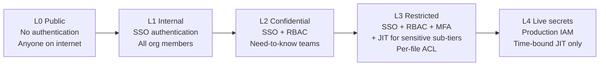

(chap-tier-architecture)=
# 03 — Tier Architecture

This chapter operationalizes [P2](#chap-principles) and [P5](#chap-principles):
how access tiers map to storage, and how they map to NIST SP 800-207
Zero Trust trust levels.

Contents:

- [The five tiers](#sec-tiers)
- [Tier ↔ Zero Trust mapping](#sec-zero-trust)
- [Tier ↔ storage mapping](#sec-tier-storage)
- [Boundary enforcement](#sec-boundaries)
- [Promotion and demotion](#sec-promotion-demotion)

---

(sec-tiers)=
## The five tiers

| Tier | Name | Who reads | Where it lives | Typical content |
|------|------|-----------|----------------|-----------------|
| **L0** | Public | Anyone on the internet | Public repo or public docs site | Marketing pages, open-source docs, public architecture overviews, recruiting content |
| **L1** | Internal | All authenticated employees of the org | Internal repo (Enterprise SSO-gated) | Onboarding, current-state architecture, internal-only design proposals, runbooks, post-mortems |
| **L2** | Confidential | Authenticated employees with documented need-to-know (RBAC) | Private repo, restricted-team access | Strategy, RFPs, financials, security threat models, board materials |
| **L3** | Restricted | Specific named individuals or small groups (per-file ACL) | Object store (Google Drive, S3 with object ACL, SharePoint) | Customer identifiable records, employee performance / comp / 1:1s, hiring scorecards |
| **L4** | Live secrets | Production systems and their on-call operators | Production-system-native storage (Key Vault, AWS Secrets Manager, Vault, IAM-gated DB rows) | Active API keys, database credentials, in-flight customer PII |

L4 is **not in EKA's scope**. EKA documents *reference* L4 content
(via pointers like `vault:secret/path` or `keyvault:org-prod/jwt-key`)
but the content itself lives in production-system controls. EKA's job
ends at L3.

(sec-zero-trust)=
## Tier ↔ Zero Trust mapping

NIST SP 800-207 (Zero Trust Architecture) describes a continuum from
"untrusted" to "fully-trusted" access. EKA's tiers map directly:



For each transition, the *added* control:

| Transition | Added access requirement | NIST 800-207 trust level |
|------------|--------------------------|--------------------------|
| L0 → L1 | Authenticated identity (SSO) | Authenticated subject |
| L1 → L2 | Role / team membership (RBAC), documented need-to-know | Authenticated + authorized |
| L2 → L3 | Multi-factor authentication; per-file ACL; sometimes just-in-time (JIT) elevation for sensitive sub-tiers | Authenticated + authorized + verified context |
| L3 → L4 | Production system controls; agentless secret retrieval; time-bound JIT only | Out of scope for docs |

### What "documented need-to-know" means in practice

L2 access decisions are recorded. The simplest implementation is a
GitHub team named `company-docs-readers` (or `{org}-leadership` —
naming is per-org); membership in that team is the access grant.
Team membership changes are PR-reviewed and audit-logged.

L2 access reviews happen at least every 90 days: the team
membership is reconfirmed by the team owner. Members who've left
the org or changed role lose access automatically (via SCIM-style
provisioning if available, or a quarterly manual reconciliation
otherwise).

### What "just-in-time" means in practice

L3 has sub-tiers. Most L3 content (e.g., a routine 1:1 note in a
team-lead's Drive folder) needs only standard authenticated access
on the named ACL. But some L3 content benefits from JIT:

- A performance review in the "calibrated" stage may be readable
  only after the lead requests access for a specific purpose with a
  time bound.
- A hiring scorecard for a candidate the org is no longer
  considering should require JIT for re-access (the file moves into
  `archive/`, accessible by request).
- Compensation data may be readable only during the review cycle.

JIT is implemented with Drive's "request access" workflow or, for
larger orgs, identity-management tools (Okta, Azure AD PIM).

(sec-tier-storage)=
## Tier ↔ storage mapping

Storage choices flow from access requirements:

| Tier | Storage primitive | ACL granularity | Why this choice |
|------|-------------------|------------------|----------------|
| L0 | Public Git repo | Per-repo (public) | Pages site, generic markdown rendering |
| L1 | Private Git repo with org-internal visibility (e.g., GitHub Enterprise "internal") | Per-repo | Single boundary; SSO already enforces "all employees" |
| L2 | Private Git repo with team-scoped access | Per-repo (team) | Need-to-know is per-team, not per-file; repo is the natural boundary |
| L3 | Object store with native per-file ACL: Google Drive, SharePoint, S3+object ACL | Per-file or per-folder | Per-file ACL is the load-bearing requirement; Git doesn't provide it |
| L4 | Production-system-native (Vault, KMS, IAM-gated DB rows) | Per-secret | Not docs |

### Why not put L3 in Git?

A few teams attempt to use private Git with branch-protection or
CODEOWNERS to enforce per-file controls. This usually fails:

- CODEOWNERS controls *who must review*, not *who can read*.
- Branch protection controls *who can write*, not *who can read*.
- Submodules with separate ACLs work but create a parallel
  hierarchy that confuses agents and humans.
- Submodules can be enumerated by anyone with the parent repo,
  leaking metadata (file names!).

Object stores with native per-file ACLs were built for the L3 case.
Use them. EKA's job is to make markdown-in-Drive a first-class
citizen, not to force per-file ACL into a tool that doesn't support
it.

### Why not put L0 in the same place as L1?

L0 and L1 use the same source format (markdown), the same toolchain
(MyST), the same site generator. The temptation is to keep them in
one repo with conditional rendering ("publish these folders to
public, others stay internal").

EKA recommends against this:

- Pages-config-as-code is one bad merge away from publishing the
  wrong folder.
- Agents reasoning about L1 content shouldn't have to filter "is
  this path public?" on every read.
- The classification model becomes "tier is determined by which
  folder you're in" rather than "tier is determined by frontmatter."
  This privileges the folder over the frontmatter, contradicting
  [P1](#chap-principles).

Separate repos for separate tiers. Cross-link via markdown
references. Each tier's site can link to the other if appropriate.

(sec-boundaries)=
## Boundary enforcement

A tier boundary holds if and only if it has three properties:

1. **Storage-enforced.** The bytes physically cannot be read across
   the boundary without traversing an auth check.
2. **Tooling-enforced.** Authoring tools cannot accidentally commit
   higher-tier content to a lower-tier repo. (Pre-commit hooks.)
3. **Agent-enforced.** AI agents in lower-tier homes cannot read or
   write to higher-tier stores. (MCP scoping, working-directory
   boundaries.)

Property 1 is what GitHub / Drive / S3 give you. Property 2 is what
EKA's frontmatter validation provides. Property 3 is the per-tier
agent topology (see [chapter 7](#chap-agent-topology)).

Missing any one of the three creates a leak vector. EKA's pre-commit
hook + agent-topology are the additions that close properties 2 and
3 over default GitHub/Drive setups.

### What boundary enforcement does NOT do

- It does not stop a malicious authorized user from copy-pasting
  content out. That's an exfiltration problem, addressed by
  separate DLP controls outside EKA's scope.
- It does not stop a user from screenshot-and-share. Same.
- It does not stop a misconfiguration that grants a team broader
  access than intended. That's an access-review problem, addressed
  by the quarterly review in [P5](#chap-principles).

EKA closes the *accidental* and the *agent-mediated* boundary
violations. The *intentional human bad actor* case is mitigated by
audit log + employment-level controls + (where applicable)
post-incident legal remedies. No purely-technical control closes
that case fully.

(sec-promotion-demotion)=
## Promotion and demotion

A document's tier may change over its life. EKA defines the workflow
for both directions.

### Promotion (lower tier → higher tier)

Scenario: a routine internal proposal grows to include
customer-specific detail and now needs to move from L1 to L2.

1. Author updates frontmatter `classification` to new SC, `tier` to
   new value.
2. Pre-commit hook in current (lower-tier) repo refuses the commit
   ("tier exceeds repo max_tier").
3. Author moves the file to the appropriate higher-tier repo with a
   single PR. Original location gets a forwarding stub:

```markdown
---
title: ...
status: superseded
replaced_by: repo:{org}-company-docs/security/threat-models/...
---

# This document has moved

The content of this document has been reclassified to L2 and now
lives in [the company-docs repo](...). See `replaced_by` for the
new location. This stub remains here for back-references; it is
not maintained.
```

4. Audit log records the promotion event with timestamp + actor +
   reason.

The forwarding-stub pattern preserves incoming links and clearly
signals the reclassification. The stub is L1 content (status =
superseded carries no sensitive content); only readers of the
higher-tier repo see the actual document.

### Demotion (higher tier → lower tier)

Scenario: information that was confidential becomes published (a
product launches, a customer goes public).

1. Author reviews the document for residual confidential content
   (often, a confidential doc has *some* parts that should remain
   confidential even after a public announcement).
2. If demotion is whole-document: redact / paraphrase any residual
   sensitivity, update frontmatter `classification` to new SC, move
   to lower-tier repo. Original L2 file becomes superseded.
3. If demotion is partial: split into a new public-facing summary
   (L1 or L0) and a remaining-confidential detail doc (L2). The
   summary links to the detail with a "for more (internal only)"
   note where appropriate.
4. Audit log records the demotion event.

### Why demotion is the more dangerous direction

Promotion fails *safely*: the pre-commit hook refuses the commit,
the author gets a clear error, the doc ends up in the right place.

Demotion fails *unsafely*: an author can willingly demote a doc with
residual sensitive content. The pre-commit hook will pass (lower
classification = OK), and the content goes into a wider-access
repo.

Mitigation: demotion requires a second reviewer on the PR
(`CODEOWNERS` rule on the target lower-tier repo for "files that
arrived from a higher tier"). The second reviewer is explicitly
asked to confirm: "did the author remove all residual sensitivity?"

This is the only place in EKA where reviewer count is explicitly
prescribed. Everywhere else, organizational PR practices suffice.

## What's contestable

- **The five-tier model is fixed; some organizations want more
  granularity.** Defense industry contractors often run more tiers
  (Restricted, Secret, Top Secret, plus compartments). EKA's
  position: those organizations have a fundamentally different
  threat model and tooling stack; the five tiers are right for
  commercial enterprise. Extending to seven or ten tiers is left
  as an exercise.
- **Putting L1 in "internal" rather than "private" Git visibility
  assumes Enterprise plans.** Smaller orgs without Enterprise plans
  must choose between "L1 = public" (no, this leaks) or "L1 =
  private with team access." The latter is fine; the boundary still
  works, the only difference is that org members must be explicitly
  added rather than implicitly included.
- **Demotion's two-reviewer requirement is the only prescribed
  reviewer-count rule.** Some organizations want this everywhere.
  EKA's position: prescribing reviewer counts at every step adds
  process drag; the demotion-specific rule is where the risk
  concentrates.

[The storage and naming chapter](#chap-storage-and-naming) goes
deeper on how each tier's storage is set up, what the file-naming
conventions look like, and how codenames work.
