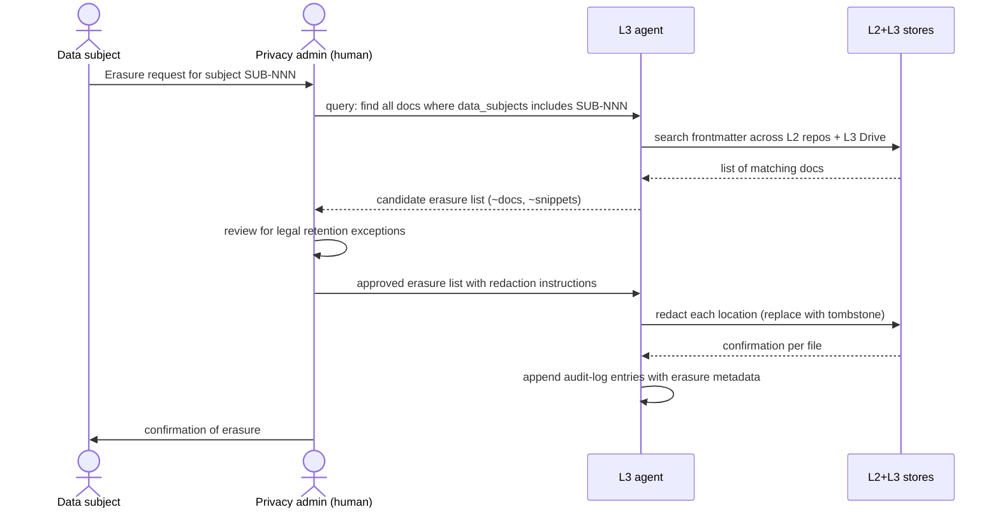

(chap-lifecycle-and-review)=
# 06 — Lifecycle and Review

This chapter operationalizes [P8](#chap-principles) (graduated
staleness) and covers the supporting lifecycle: review cadence,
erasure workflows, and offboarding.

Contents:

- [Enumerations used in lifecycle metadata](#sec-enums)
- [Review cadence by tier](#sec-review-cadence)
- [Staleness flagging](#sec-staleness)
- [Why not auto-elevate classification](#sec-no-auto-elevate)
- [GDPR Article 17 erasure workflow](#sec-erasure)
- [Employee offboarding](#sec-offboarding)
- [Customer offboarding](#sec-customer-offboarding)
- [Annual classification audit](#sec-annual-audit)

---

(sec-enums)=
## Enumerations used in lifecycle metadata

Three lifecycle-related frontmatter fields are enumerated (must be
one of a fixed set of values). Documenting them explicitly:

### `status` — workflow state

| Value | Meaning |
|-------|---------|
| `draft` | Author is working on it; not ready for review or use |
| `review` | Circulating for reviewer feedback; not yet authoritative |
| `approved` | Reviewed and accepted; the canonical version |
| `review-due` | `approved` content past its `next_review` date; auto-set by the staleness check |
| `superseded` | Replaced by a later document; `replaced_by` field set |
| `archived` | Moved to the `archive/` folder due to staleness or end-of-relevance |

Valid transitions:

```
draft → review → approved
                  ↓
                review-due (auto-set after `next_review` passes)
                  ↓
                approved (after renewal) → ... cycle continues
                  ↓
                archived (after 90d overdue → archive/)

approved → superseded (when a successor document replaces this one)
```

### `review_notes.type` — required on renewal PRs

When a PR bumps `last_reviewed`, the frontmatter must include a
`review_notes` block declaring the review type:

| Value | Meaning | When to use |
|-------|---------|-------------|
| `substantive` | Content was edited; status stays / moves to `approved` | Author updated the doc based on new info or fixes |
| `no-change` | Reviewed and found accurate as-is; bumping `last_reviewed` only | Cadence check; doc is still current |
| `deferred` | Cannot review now; extending grace period | Owner on leave, dependency review pending, etc. |

Each type requires additional context:

| If type is | Required additional field(s) |
|------------|------------------------------|
| `substantive` | `changes:` (free-text describing what changed) |
| `no-change` | `verified_against:` (what evidence confirms accuracy) |
| `deferred` | `reason:` + `new_next_review:` (new ISO date) |

### `expiry_action` — what happens when `expires_at` passes

`expires_at` is an *optional* frontmatter field for time-bounded
content (e.g., incident war-room notes, active hiring-loop
materials). When set, `expiry_action` chooses what happens on the
expiry date:

| Value | Behavior | Default? |
|-------|----------|----------|
| `archive` | Move to `archive/`; preserve content for history | ✓ default |
| `restrict` | Tighten ACL to original author + compliance only | |
| `delete` | Hard-delete content; retain only the audit-log entry of its existence | |

Most content does NOT set `expires_at`. It's opt-in for content that
was always intended to have a bounded life.

---

(sec-review-cadence)=
## Review cadence by tier

Default `review_cadence` per tier:

| Tier | Default cadence | Rationale |
|------|-----------------|-----------|
| L0 | 365d (annual) | External-facing content drifts slowly; annual is enough |
| L1 | 365d (annual) | Eng-wide content moves at the rate of the codebase; annual matches release cadence |
| L2 | 180d (semi-annual) | Business content moves faster; customer relationships and strategy change quarterly |
| L3 | 90d (quarterly) | Personnel data, especially performance and 1:1 notes, decay fastest; quarterly aligns with perf cycles |

Domain overrides (set in `CLASSIFICATION.yml`):

- Operational runbooks: 180d regardless of tier
- Customer-specific content: 90d regardless of tier
- Threat models: 90d (security context changes fast)

Author may override per-document via frontmatter, but cannot exceed
2× the cadence default without an explicit `override_reason`.

(sec-staleness)=
## Staleness flagging

Documents past their `next_review` date trigger a graduated response:

```
   On time                Yellow flag                Red flag                  Purge candidate
        │                       │                       │                            │
        ▼                       ▼                       ▼                            ▼
  ┌──────────┐         ┌──────────────┐        ┌───────────────┐           ┌──────────────────┐
  │ Active   │ +30d ─→ │ Review-due   │ +60d ─→│ Stale +        │ +275d ──→│ Purge candidate  │
  │          │         │ (visible flag│        │  archive move │           │ (human review)   │
  └──────────┘         │  in HTML)    │        └───────────────┘           └──────────────────┘
                       └──────────────┘
```

| Days past `next_review` | Status | What happens | Reversible? |
|-------------------------|--------|--------------|-------------|
| 0–30 | On time / grace period | Nothing | Yes |
| 30–90 | Yellow flag | HTML render shows yellow banner: "Review due 45 days ago." Frontmatter `status: review-due` automatically. Agents still serve. | Yes — `last_reviewed` reset clears the flag |
| 90–365 | Red flag + archive | HTML render shows red banner: "STALE — last reviewed N days ago." File moved to `archive/{original-path}` with a forwarding stub in the original location. Agents serve from archive with stale warning. | Yes — review action moves file back |
| 365+ | Purge candidate | Quarterly review surfaces these for human decision: delete, restore, or keep-with-extended-justification | Yes until purged |

### Concrete behaviors

**Yellow-flag (30 days overdue):**
- Frontmatter status auto-flips from `approved` to `review-due` (via
  scheduled GitHub Action; commit message: `eka-bot: flag review-due`).
- HTML site adds a banner: *⚠️ Review due {N} days ago. Verify before
  relying on this content.*
- Agent prompt context includes the staleness flag when reading the
  doc.

**Red-flag (90 days overdue):**
- File moved to `archive/{tier}/{year}/{original-path}` via a single
  PR auto-opened by the bot.
- Original location keeps a forwarding stub:
  ```
  ---
  title: "[ARCHIVED] {original title}"
  status: archived
  archived_at: 2026-08-15
  archive_location: archive/2026/proposals/foo-bar/
  ---
  This document has been archived for staleness. See the archive
  for the historical content. If still relevant, restore via PR.
  ```
- HTML render of the stub: large red banner pointing to archive.
- Agent reads from archive but always prefixes responses with the
  staleness warning.

**Purge candidate (1 year overdue):**
- Surfaced in the quarterly classification audit as a list.
- Human reviewer decides per item: delete (purge from git history if
  contains regulatory-erasure-eligible content), restore (move back
  and update), or extend (rare; requires `override_reason`).
- No automatic deletion ever.

### Renewing a doc

The simplest renewal is a PR that updates `last_reviewed` and
optionally bumps `review_cadence`. To avoid rubber-stamping, the PR
must include a `review_notes:` field with one of:

```yaml
review_notes:
  type: substantive                      # content edited, status approved
  changes: |
    Updated the rate-limit section to reflect new Front Door rules.
    Removed reference to deprecated /v1 endpoint.

# OR:

review_notes:
  type: no-change                        # reviewed, found accurate as-is
  verified_against: |
    - Current code in {repo}/{service}
    - Runbook entry "incident-response-2026-q1"

# OR:

review_notes:
  type: deferred                         # cannot review now, extend grace
  reason: "Service owner on leave. Extending 30 days."
  new_next_review: 2026-09-15
```

The pre-commit hook for review-bump-PRs requires one of these three
types; PRs lacking `review_notes` are rejected. This is the only
case in EKA where commit-message-equivalent metadata is required by
tooling.

(sec-no-auto-elevate)=
## Why not auto-elevate classification

A natural defensive-default is "if no one reviewed this in a year,
the classification must be elevated — assume it might contain
something sensitive we don't remember."

EKA explicitly rejects this approach. The reasoning:

**Auto-elevation has worse failure modes than staleness flagging.**

| Concern | Auto-elevate handling | Graduated staleness handling |
|---------|----------------------|------------------------------|
| Stale doc still in active use | Becomes inaccessible — readers / agents fail | Flagged but accessible; degraded UX, not broken |
| Stale doc contains time-bound info no longer true | Inaccessible to the people who'd notice and fix it | Flagged red, archived; fixers can still see it |
| Stale doc that's correct but no one's looking | Inaccessible until rediscovered | Flagged but agents/humans still find via search |
| Authors leave a doc to drift on purpose ("this is fine") | Forces immediate attention via inaccessibility | Eventual archive after a year — gentler nudge |

Auto-elevation is the **break-not-bend** posture; graduated staleness
is the **bend-then-break** posture. In knowledge systems where the
operating cost of inaccessibility is high (agents failing,
on-callers blocked) and the leak risk of a stale-but-still-correct
doc is low (most stale docs remain accurate to their tier), the
bend-then-break posture wins.

### Callout: the contrary case

There IS a class of content where auto-elevation makes sense: **time-bound
operational information whose access should expire**. Examples:

- Active incident war-room notes (expire 30 days after incident
  closure)
- Active customer-acquisition-mode pricing terms (expire when deal
  closes)
- Active hiring-loop candidate evaluations (expire when loop ends)

For these cases, EKA recommends an explicit `expires_at:` frontmatter
field rather than relying on staleness. Documents with `expires_at:`
in the past become inaccessible to non-owners on the day after
expiry. This is a *deliberate* elevation, not a side-effect of
staleness — and it's appropriate because the content was always
intended to have a bounded life.

```yaml
expires_at: 2026-12-31                   # opt-in time-bounded access
expiry_action: archive                   # archive | restrict | delete
```

(sec-erasure)=
## GDPR Article 17 erasure workflow

When a data subject invokes their right to erasure:



### The tombstone format

Erased content is replaced with a tombstone, not silently removed:

```markdown
[REDACTED — GDPR Art. 17 erasure request 2026-05-15. Original
content referenced subject SUB-NNN. See audit log for details:
audit-log/erasures/2026-05-15-SUB-NNN.md]
```

The tombstone signals "something was here, removed for a reason."
This prevents the confusion of "this paragraph is incoherent — was
content lost in a merge?" The audit log entry (itself L3, accessible
only to compliance + legal) records the full context.

### Why not actually delete from git history?

`git filter-repo` to purge history is a heavyweight operation that:

- Invalidates all existing clones and forks
- Requires coordination across all contributors
- Loses other history alongside the targeted content

For most GDPR erasures, the tombstone approach is **legally
sufficient and operationally tractable**. The content is no longer
*available* in the published view; auditors confirm with a fresh
clone. The tombstone serves as evidence of compliance.

The full-history-purge is reserved for the rare case where the
original content presents ongoing harm (e.g., it contained
unredacted live credentials, customer PII that triggers regulatory
notification, etc.).

(sec-offboarding)=
## Employee offboarding

When an employee leaves the org, their EKA footprint is reconciled:

### Day of departure

1. **Revoke access** — remove from all GitHub teams, Drive folder
   memberships, MCP tokens. This is HR-led, not EKA-specific.
2. **Reassign ownership** — every doc with `owner: {departed-employee}`
   needs a new owner. The L1 manifest agent runs a query:
   ```
   find all repos where owner = "{departed-employee}"
   ```
   Returns a list. Their manager (or a designate) reassigns. PRs
   updating `owner:` field are bulk-merged within 7 days.
3. **Their 1:1 / feedback notes (L3 Drive)** stay in place with
   updated ACL (the departed employee loses read access; their
   manager retains).

### Within 30 days

4. **Personal notes / drafts** — any markdown owned by the departed
   employee in their personal Drive folder, scratch repos, etc.,
   gets reviewed for retention. Most is discarded; anything with
   knowledge that the org needs gets migrated to the appropriate
   tier with a new owner.
5. **Codename-mapping updates** — if the departed employee was an
   entity owner in CODENAMES.yml (`primary_owner:`), update.

### Within 90 days

6. **Audit log retention review** — their audit-log entries are
   retained per the standard policy (12 months minimum). No special
   action.

(sec-customer-offboarding)=
## Customer offboarding

When a customer relationship ends:

1. **Frontmatter update on customer-specific content** —
   `status: archived` on every doc with `codename_refs: [{customer-code}]`.
2. **CODENAMES.yml update** — set `disclosure: historical`. The code
   is not reused; reuse would create cross-document confusion.
3. **L3 Drive folder for that customer** — moved to `archive/`
   with restricted ACL (account owner + compliance only). Retention
   per contractual / regulatory requirements (typically 3–7 years).
4. **Live customer data in production systems** — separate from
   docs, handled by data-team's customer-offboarding playbook.

(sec-annual-audit)=
## Annual classification audit

Once a year, EKA's compliance owner runs a full classification audit:

1. **Inventory** — total documents per repo, per tier. Compare YoY.
2. **Domain distribution** — share of documents per domain. Drift
   from baseline indicates classification drift.
3. **Stale doc count** — yellow + red + purge-candidate breakdown.
4. **Override reasons** — sample 10% of docs with `override_reason`;
   verify the reasons are still valid.
5. **Codename usage** — confirm no file paths in L2+ repos contain
   real entity names.
6. **Access review** — confirm team memberships still match
   need-to-know (separate cadence: quarterly access review at L2+).
7. **Erasure log review** — confirm all GDPR Article 17 requests
   were fulfilled and audit-logged.

The audit produces a markdown report with findings, owners, and due
dates. Report itself is L2 (it summarizes the state of the L2 store).

A reference audit-report template is in
[chapter 10](#chap-implementation-roadmap)'s appendix.

## What's contestable

- **The 30/90/365-day staleness thresholds** are EKA's defaults.
  Faster-moving orgs may want 14/45/180; slower-moving orgs may
  want 90/270/1095. Tune per organizational metabolism.
- **Tombstone vs. full-purge** for GDPR erasure is the regulator
  question. EKA's recommendation (tombstone unless ongoing harm)
  reflects current regulatory practice (2024–2026 era) but is not
  legal advice; consult counsel.
- **Annual audit cadence** is appropriate for most orgs but
  regulated industries (financial services, healthcare) may need
  quarterly. Adjust per audit-requirement.

[The agent topology chapter](#chap-agent-topology) covers what
agents look like in this system: per-tier scoping, MCP boundaries,
and the audit trail.
